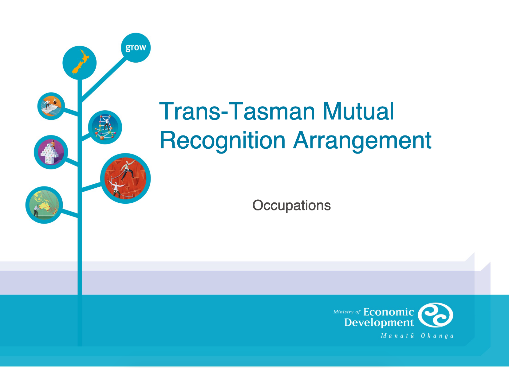
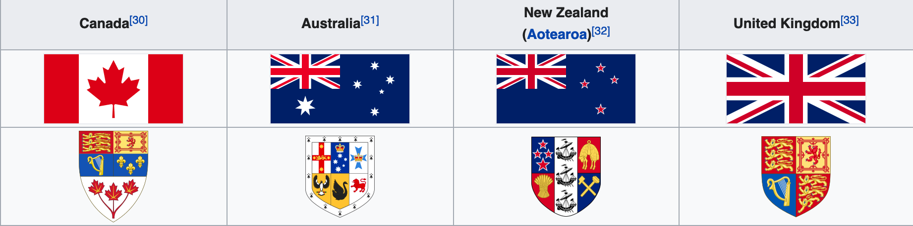

**文章导读：**
1. 大一统必然形成专制集权，中国历史上文化最灿烂辉煌的反而是四分五裂的春秋战国时代
2. 澳洲和新西兰两个国家之间的公民可无限期居住工作、专业资格 100% 互认、社保医保互通，跟生活在一个国家没太多区别
3. 无论是第一次还是第二次世界大战，新西兰、澳洲、加拿大等英国自治领始终站在英国一边参战，情谊超越国界
4. 内地居民去名义上属于中国的香港、澳门也需要签证，去新疆西藏受到诸多限制，等同出国

<!-- more -->

# 大一统不是唯一出路

我们中国人被中共多年洗脑，总觉得大一统才是正确的，台湾、新疆、西藏、香港都不准独立，独立就是所谓分裂，就是汉奸和民族罪人。但是统一必然形成专制集权，也禁锢了中华民族思想长达两千年，可以说自秦以来中国历朝历代治国平天下都是凭借春秋战国世界的儒家思想的仁义道德为表、法家驭民五术为里的统治秩序。相反中国历史上文化最灿烂辉煌的反而是四分五裂的春秋战国时代，诸子百家、百家争鸣，其思想滋养了此后两千年的中华文明，往后的历朝历代都没有超越，反而不断研习诸子经典没有任何突破。可以说没有鸦片战争撬开国门，中国这片土地还会延续两千多年的老路走下去，不会孕育出现代文明。

一直以来宣传的统一有利于集中力量办大事，其实统一只对当权者有好处，面子大，可以剥削更多的人民。历朝历代所谓帝王将相的丰功伟业其实和老百姓半毛钱关系没有，“兴，百姓苦，亡，百姓苦”才是真实的写照。举个例子，如果中共国不是绑架了 14 亿人民，哪里有财力物力建造高科技的网络防火墙，哪里能打造出无孔不入的微信微博QQ大数据 1984 监控体系呢？像俄罗斯、委内瑞拉他们没有条件集中那么大的力量去办这些当权者的“大事”。

# 澳洲和新西兰的紧密联系

那同根同源的两个地方除了统一之外，还有其他的联系方式吗？假如说共产党倒台以后台湾、新疆、西藏、香港，甚至如文贵先生所说的广东也独立了，当然这一切要取决了当地人民的意愿。那么在这样四分五裂的国家里经济贸易、旅游、生活会否带来很大不便，人民还能过上好日子吗？

当然能，我们看看英联邦国家就知道，这种基于共同信仰、共同普世价值理念的联系纽带异常牢固。用我们熟悉的历史做比喻，就像三国刘备关羽张飞三人桃源结义之情，歃血为盟，同生死共患难，比亲兄弟骨肉情还深。

澳洲和新西兰占人口大多数的白人来自于英国移民，可谓同根同源，有共同的文化和历史背景、宗教信仰，地缘上也相对接近，坐飞机三个小时就能到达。澳洲和新西兰有多项双边协定，对于这两个国家的人民来说，跟生活在一个大澳新国差不多，工作生活上基本畅通无阻。比所谓的属于同一个中国的香港、澳门和内地的联系要紧密的多，人员流动也自由得多。

下面我们看看两国间签订了多少双边协议来促进两国人民间的交流。

## 跨塔斯曼海旅行协议（Trans-Tasman Travel Arrangement）

[跨塔斯曼海旅行协议](https://en.wikipedia.org/wiki/Trans-Tasman_Travel_Arrangement)于 1973 年生效，主要目的是让澳洲和新西兰两国公民可以自由从其中一国进入另外一国，进行工作和生活，无论是临时性的还是永久。新西兰公民进入澳洲自动获得一个 Special Category Visa 签证，可以允许无限期居留和工作。澳洲公民进入新西兰则直接获得 Resident Visa 居民签证，就是我们华人俗称的 PR。除了失业保险外，大部分福利也都能享受，例如医疗、教育、养老、低收入家庭生活补助等等。

根据 2013 年统计数据，目前新西兰有 65 万人在澳大利亚居住，而澳大利亚有 6.2 万人在新西兰居住。每年有大约 100 万新西兰和澳大利亚人在两国间流动。

可以看到，真正为人民服务的政府就是应该考虑到人民的生活便利，既然允许人员自由流动，那么相应的福利和保障也要跟上。文明社会不可能允许出现像中共国治下的农民工，在城市里奉献自己的劳动力，却丝毫得不到保证，生老病死听天由命。中共国的社会是个制度化剥削穷人补贴富人的社会，外地工人五险一金一分钱不少的缴纳无需户口，享受福利却有百般刁难需要户口，社保医保不能跨市跨省转移，等退休了以前缴纳的费用就白交了。正由于福利滞后，外地工人无法在城市安家落户教育子女，出现大量留守儿童，长期和父母分居两地得不到应有的关爱和照顾。你看看人家跨国的福利都能共享，都能转移，我们连转到隔壁城市都很困难！

## 跨塔斯曼海互认协议（Trans-Tasman Mutual Recognition Arrangement）

**跨塔斯曼海互认协议**（[原文在此](https://docs.employment.gov.au/system/files/doc/other/users-guide.pdf)）自 1998 年生效，是 1993 年开始生效的澳洲各州之间的互认协议的自然延伸，目的是促进区域经济融合、消除阻碍货物和人员流动的监管制度障碍。

> **塔斯曼海（Tasman Sea**：分隔开新西兰和澳洲的一片海域，宽度约 2000 公里，以发现新西兰和澳洲塔斯曼尼亚岛的荷兰探险家阿贝尔·塔斯曼命名。

协议主要包含两部分，第一部分是关于**货物自由流动**。基本上所有在澳洲可以合法（无论是当地生产或者进口）销售的商品，在新西兰也可以无障碍的销售，反之亦然。这就涉及到产品标准统一，我们知道产品都要符合一定的标准要求才能上市销售，保障消费者能购买到符合质量要求的产品。例如室外建筑用的木材划分有很多个等级，需要符合相应的防腐蚀要求，是直接和地面接触的木桩 H4、还是没有直接接触只是作为室外地板或者墙面 H3，这个标准和代码在澳洲和新西兰都是通用的，同样的木材可以直接在两个国家销售。

这就要求两个国家的监管机构能互相合作制定标准，为了消费者利益出发，而不是为了利用手中的审批权力寻租捞钱，人为设置障碍和壁垒。其次是相应的司法仲裁系统要公正，司法体系要相通，否则企业在另外一个国家的利益无法得到保证，自然也无法在当地做生意，促进两国贸易往来自然也无从谈起。

第二部分是**专业人员的自由流动**。在外国生活的人都知道，很多职业例如水管工人、电工都是需要注册的，很多需要进入专门类似我们国家专科学校学习并经历学徒实习阶段。没有资格认证是无法从事那项职业的，请了不合格人员施工所导致的质量问题也没有任何保障，所以没人敢请没有资质的工人。这个协定就消除了这种注册职业的障碍，所有在澳大利亚取得资格认证的所有专业人员，在新西兰也可以从事相应工种，反之亦然，只需要在登陆当地时简单的填个表格登记就行。

医生职业不在本协议规定范围内，但医生有另外的类似的互认协议，只要在其中一国接受教育和训练的医生，同样的可以在另一国无障碍地执业。例如你在澳洲接受医学教育并作为家庭医生 GP，你可以毫无障碍的去新西兰从事同样的职业，收入、社会地位没有降低，可以迅速有尊严的融入新西兰当地社会。当地的洋人很多活的很洒脱，一会儿搬到悉尼工作，生活几年觉得厌倦了，或者纯粹是接到一个更好的工作机会，就能刷的一声搬到新西兰。我们在国内的时候都不敢随便跨市流动，转移一次社保医保相当于剥掉一层皮，缴纳的钱丢一大部分办事也跑断腿，上学买房很多都要求在当地缴纳社保满多少年，真的跟出国移民差不了多远。

## 社会保障协定(Social security agreement)

新西兰和澳洲签订了[社会保障协定](https://www.workandincome.govt.nz/pensions/travelling-or-moving/social-security-agreements/australia.html)，社会保障包含退休养老保险和伤残保险，澳洲和新西兰的居民无须担心自己在哪个国家居住了多少年，都可以在两国间自由退休，领取的退休金额跟当地人同等水平。具体细节方面的账目清算那些都是政府部门负责，我们普通老百姓只要按照要求提交了申请资料就完事，不想在国内办事啥都要自己操心跑腿，反而官老爷乐得清闲撒手不管。

还有一点和中共国不同的是社会保障是根据你居住时间定的，例如新西兰法定是 65 岁退休，要求你在 20-65 岁之间必须在新西兰**居住**满 10 年才能在退休后享有福利，注意是居住，不需要工作，就是说残疾人或者由于各种原因无法工作的，也能保障能安享晚年，不至于老无所依。

除了澳洲之外，新西兰还和多个国家签订了类似的协议，包括加拿大、英国、丹麦、希腊、爱尔兰共和国、马耳他、荷兰、太平洋诸岛国、海峡群岛（位于英吉利海峡的英国皇家属地），退休后可以自由的在这么多个国家生活并领取基本的退休金。小小的一个仅有五百万人口的小国新西兰，居然和这么多个国家建立了这么紧密的联系，给人民生活带来这么大的便利和自由，这才是国家强大、人民有尊严的标志，这是到处撒币都买不来的。

## 健保互惠协定

新西兰、澳洲和英国三国间签订有[健保互惠协定](https://www.health.govt.nz/new-zealand-health-system/eligibility-publicly-funded-health-services/reciprocal-health-agreements)，允许临时（两年之内）到对方国内的公民得到与所到国国民相同待遇的“立即、必要的医疗救护“，主要是在公立医院的治疗，不包含家庭医生。长期居留两年以上的澳洲、新西兰两国间公民享有所有的和所在地同等的医保待遇；在英国长期居留需要签证，待遇参照所持有的工作签证而定。

## CANZUK

英国、加拿大、澳洲和新西兰这四个联系紧密的国家的民间团体还有一个建立四国间类似于欧盟的联盟的建议，代号为各国名称首字母 CANZUK，实现类似于澳洲和新西兰间的人员和货物的自由流动。这个建议在民间有很大的支持意见，在各国也有政党和研究机构支持这个畅想。

## 两次世界大战

第一次世界大战 1914 - 1918 年期间，当英国向德国宣战时，当时作为大英帝国自治领的新西兰马上跟随，并派出了 10 万军事和医疗后勤人员到欧洲战场作战，而当时新西兰仅仅有 110 万人口，相当于人口的十分之一左右。

同样的第二次世界大战 1940-1945 年期间，新西兰也派出了 14 万人员赶赴欧洲战线作战，占当时总人口 160 万也是差不多十分之一。同时还源源不断的运输农业物资到英国，成为遭遇密集空袭的英国抵御德国的坚强后勤支持。大英帝国的其他自治领加拿大、澳洲、印度也是类似的加入了战争，甚至英王乔治六世还曾考虑流亡加拿大。而美国当时由于国内孤立主义盛行，直到 1941 年 9 月 11 日才正式向德国宣战，可以说没有大英帝国各自治领的加入，在欧洲大陆全面沦陷的情况下，仅凭英伦三岛很难抵挡住纳粹德国的入侵。

# 其他地区联盟

白俄罗斯和俄罗斯两国间，英国和爱尔兰共和国之间也有类似于澳洲新西兰的旅行协议，可以无限期居住和工作。

欧盟 27 个国家之间也可以免签证免边检自由流动，自由工作，享受社会福利。但是欧盟区内部国家发展水平差距较大，移民政策导致了不少问题，英国脱欧是这种矛盾激化的表现。

# 中国实际现状

我们再来看现在所谓统一的中国的现状。台湾不用说，事实上是一个独立的国家，有独立的由全民选举出来的政府，行使独立的外交、国防、经贸政策。中共国所能做的只是掩耳盗铃，通过威逼利诱等方式让绝大多数国家和国际组织否认台湾的存在，不让台湾拥有邦交国和加入任何国际组织。

再说说所谓的独立行政区的香港，大部分内地居民去香港旅行必须提前申请所谓的通行证和签注，其实就是出国用护照和签证，只是掩耳盗铃的另外取了一个名字。也不能在香港工作，货物流动跟跨国进出口一样需要过边检，名义上统一实际上对普通人来说就是另外一个国家。比较一下更气人，我们一次旅游签注可以停留香港 7 天，可是我们整天贬低的经济不如我们发达的印度居然能一次停留 14 天，更不用说对于发达国家例如新西兰的直接免签停留 90 天，到底谁最歧视中国人呢？到底香港属于哪个国家的？

就是是中国内地各地方之间也存在强烈的地方保护主义，本地企业得到特殊照顾，外地企业想进入特别困难，形同一个个小的独立王国。社保医保等福利保障跨市跨省转移、统筹提了几十年始终无法实施，只有少数沿海发达省份各市之间可以有条件转移，绝大部分地方你走了社保医保就白交钱福利无法享受。还有买房也存在严重的限购政策，需要在本地连续缴纳社保两年甚至五年才有资格买房。加上束缚人的户口制度，种种的阻碍使得你在中国国内的迁徙困难重重，转移一次至少脱一层皮，远远不如人家作为两个独立国家的澳洲和新西兰。

# 总结

两个独立国家之间的互通协定是更高级、更文明的联系方式。如果说大一统就像是家长说了算，家里的小孩子只有听话和孝顺的份不能有任何反抗。那么互通协定就像两个人格独立的生意人，基于互惠互利的原则签订生意合同，合作愉快的话合同一直有效，合作出现隔阂也能好聚好散。朝代有更迭，基于共同价值观、共同利益的联合其实更可靠。

在中共国最难以理解的一点，在西方文明国家理所当然的一点是签了协议要履行，双方为了自己的利益在签字前据理力争打嘴仗都很正常，但一旦签字就要忠实的履行协议的义务。这方面中共国其实相比 100 多年前的大清朝其实毫无长进，大清朝毕竟从来没和西方现代文明国家打过交道，还情有可原，中共国就真正是厚颜无耻泼皮耍赖，只想捞好处不想付出一分一毫。任何两国签订的条约想要长久维持，都是以互惠互利为基础的，澳洲和新西兰的互通条约让双方企业可以自由进入对方市场，双方企业得到了实惠自然会坚定的支持，两国之间的关系才能长久。

所以说，勉强维持的大一统只是皇帝好大喜功的面子功夫，就算四分五裂，只要各国人民有意愿有需要联合在一起还有其他方式。紧密点的组成一个像美国一样的联邦共和国，各州之间各过各的小日子，外交国防大事和跨州事务才交给联邦政府；松散的也可以如澳洲和新西兰，大家相互独立，但人员货物流动自由无阻碍，对老百姓来说跟在同一个国家没有区别。

