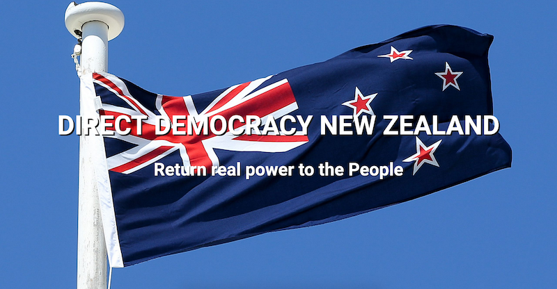

---
title:【火柴练习课】介绍首个承认新中国联邦的新西兰政党——直接民主党
---

<iframe width="420" height="315" src="https://www.youtube.com/watch?v=5eVRdEJ9ROY" frameborder="0" allowfullscreen></iframe>

2020年9月21日，喜马拉雅新西兰农场战友群里传来喜讯，*新西兰直接民主政党*(Direct Democrazy New Zealand)总秘书长*克里斯·纽曼（Chris Newman*接受老班长等人采访（[Gnews采访内容链接](https://gnews.org/zh-hans/375651/)），明确表示很高兴看到新西兰有许多追求自由的中国人挺身而出和他们一起对抗中共这个恶魔，他愿意更多地了解爆料革命和文贵先生为中国的自由民主所做的事，并对新中国联邦表示支持。

[TOC]

# 1 直接民主党简介

我们来了解一下这个直接民主党（[网站在此](https://directdemocracy.nz/)），克里斯·纽曼先生是其总秘书长和创始人，该党于2020年2月新成立，在不久前的8月18日作为独立运作的成员党派加入前进党（Advance New Zealand），共同组成一个由五个小型新兴政党组成的联盟。直接民主党的主要纲领就是**直接民主**，倡导瑞士式的对重大政策和法案的全民公投式民主，让人民直接掌控国家政策，防止政府签订不利于人民的外国条例（例如气候协定、接收联合国难民）和本地政策法规（例如出售战略性资产与资源给外国）。

## 1.1 什么是直接民主？

我们知道瑞典以公投著名，除了常规的立法议会外，还平均一年公投4次，而且公投结果**具有法律效力**（binding），必须被政府履行。对于任何联邦通过的法律或者涉外条约（如气候变化公约）的修改或否决，在通过后的100天内，只要收集5万个有效签名即可要求进行全民公投，获得多数票即可；若需要修改宪法或者加入集体安全机制（如欧盟、北约）发起公民提议（Popular initiatives），则需要收集10万个签名（约占选民总数2%）才能发起公投。

由于有公投这个利器的存在，议会里多个党派之间反而更倾向于妥协寻求最大公约数，因为他们知道若强行通过法案却过分损害另外一方利益，对方可以发起公投来否决议案。被否决的话，一是政客没有面子，二是之前立法程序白走了，一切又要重头来过，费时费力。

除了联邦层级，在地方议会也有很多公投，议题无所不包。小到批准学校新建校舍或修新路的财政预算，针对性工作者政策的变更，大到修改宪法，更改瑞士的外交政策等等。据统计从1995年1月到2005年6月，瑞士民众共对103个联邦议题进行了31次公投，这还不包括地区事务的公投。而在同样的时间里，相邻的法国民众仅公投2次。

值得一提的是虽然很多民主国家对于重大议题都采取全民公投决定，例如北爱尔兰独立、英国脱欧，但公投只能由议会发起，所以必须先形成强大的民意基础议会才有可能去推动公投。而世界上只有三个国家可以由人民直接发起公投，这就是瑞士、意大利和我们新西兰。但和瑞士不同，新西兰公投门槛高很多，必须征集10%登记选民签名（瑞士是约2%），而且公投结果只是建议性质，政府有权不执行。

## 1.2 直接民主党主要政策

直接民主党还是反对共产党的政党，在其[政策纲领](https://directdemocracy.nz/discussion-points/)就专门提到了中共购买新西兰本地企业和资源的行为就是一种殖民主义和对新西兰主权的侵犯。原文如下：

> Foreign State ownership as practiced (for example) by Chinese Communist Party agencies is a sinister form of Communist/imperialist colonisation and an insult to New Zealand citizen’s sovereignty. 

该党还支持川普和支持英国脱欧，[还说到赞扬美国人民选择了发誓“排干沼泽”的川普总统](https://directdemocracy.nz/2020/05/10/if-we-dont-own-our-country-we-wont-have-any-say-in-running-it/)。类似于美国川普政府的政策，把新西兰人民放在首位，废除不利于新西兰的国际条约，推出国际组织。

与此同时主张加强军事力量，加强和传统五眼联盟盟友的关系，共同对抗中共的军事威胁。

总体来说是一个比较偏自由经济、保守主义的小政党，和美国川普政府的政策有诸多类似。直接民主党所属的前进党政策也相近，还明确支持羟氯喹，我们在下篇文章再详细介绍。

# 2. 新西兰政党生态

新西兰的政党主要有国家党（National）和劳工党（Labour），前者偏向自由经济、减税，后者偏向福利、国家干预经济。像上一次2017年大选两党占据了总5/6议席，剩余1/6由三个小政党瓜分。组建政府需要过半数议席，所以得票最高的大党都需要联合政策相近的政党组阁。小政党虽然议席少，但大党就缺那关键的最后几票才能组阁，就有较大的谈判筹码。例如2017年大选国家党虽然得票最高，比第二名的劳动党多9个议席，只需要再争取6个议席就能组阁。但最后**劳工党最终和其他小政党妥协，反而成功获得过半数**议席成功组阁当政。

在新西兰组建政党非常简单，所以小政党林立，竞争激烈，但绝大部分不出几年就消亡。有趣的是有些党就是为了单一目标而建立的，例如大麻党专攻大麻种植与使用合法化，户外党专注于保护户外环境与资源。

所以说小政党虽小，但**只要得到哪怕几个议席，在组阁谈判中也能有较大筹码和大党谈判，从而推行自己的政策**。

# 3. 小结

新西兰大选在10月17日举行，各大小政党忙着宣传自己的政策讨好选民。火柴的下一篇文章整理新西兰各党的简介和政策，方便新西兰的战友们参考。了解各政党政策，选择对自己最有利的政党是民主社会公民最基本的权利和义务，海外战友多积累经验将来可以更好贡献新中国联邦。

是政治就涉及到党争，就像我们不掺乎美国政治我们也不要参与当地政党间口水战，但是对于政策于我们有利的政党应该予以支持。我们当地华人要踊跃支持对爆料革命、新中国联邦有利的政党，根据新西兰的选举规则，小政党也能有关键时刻话语权，可能就差我们手中的一票！

**火柴练习课**：民主就像骑自行车，加以练习人人都可熟练掌握，谁敢说中国人素质低不配骑自行车的？