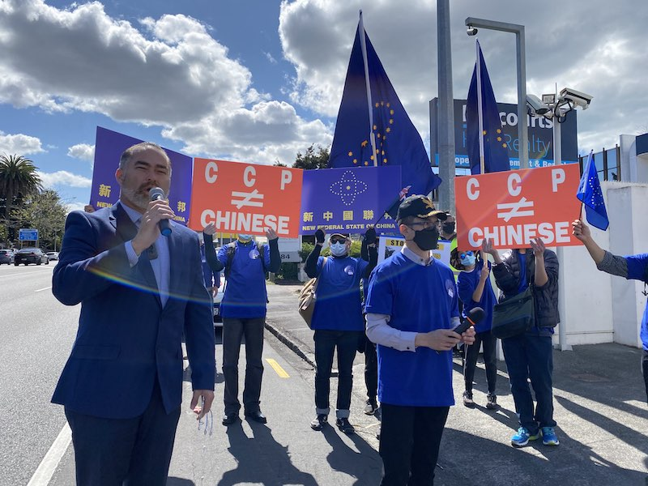

2020年10月01日，喜马拉雅新西兰农场举行大游行，并再传来重大好消息，【新西兰前进党Advance NZ】成员*克里斯·纽曼*先生和共同党魁（co-leader）*比利·蒂·卡希卡*（Billy Te Kahika）先生分别发言，他们均表示非常乐于和新中国联邦合作，共同把中共的黑暗势力赶出纯净的新西兰！他们郑重强调：承认新中国联邦，并欢迎新中国联邦的正义人士和他们未来更好的全面合作！他们的支持在世界上成为了第一个承认新中国联邦的政党。

共同党魁（co-leader）*比利·蒂·卡希卡*（Billy Te Kahika）先生是新西兰土著的毛利人，之前主要是作为一个音乐人活动，但在中共病毒肆虐后决心从政。他的很多观点和爆料革命不谋而合，例如他根据自己在军队情报处服役的经验研究后，认为比尔·盖茨资助了冠状病毒的研究、资助了中共科学家武器化冠状病毒。在没有内部情报来源的情况下这是很了不起的发现，真正代表了独立思考。**可是同样被当地主流媒体批判为“阴谋论”**，传播真相仍然任重道远。

另一位共同党魁（co-leader）詹米李·罗斯（Jami-Lee Ross）先生也是一个吹哨人，在2018年告发其所在的国家党前党魁Simon Bridges收受中共商人10万新西兰元的贿赂，目前案件还在审理中。也是由于此事件罗斯被赶出国家党，并与2020年组建了现在的【新西兰前进党】。他后来甚至被指控参与了这个受贿事件，案件目前正在法院审理中，相反Simon Bridges没有收到任何调查。所以对吹哨人的打压无处不在。

可以看到他们两人都对中共的邪恶有清醒的认识，一个因为独立思考说出真相被批判为阴谋论，一个揭发腐败被逐出政党，他们和新中国联邦、爆料革命走在一起是必然的。这里我们专注于介绍选举和各政党，对于两位先生更具体介绍我们下篇文章再谈。

[TOC]

新西兰大选将于10月17日举行，但是从10月3日起就可以开始投票了，在2017年真正在选举日当天投票的人只占53%。今年除了大选外，还会就**安乐死**以及**大麻合法化**两个议题进行全民公投。

# 1. 新西兰MMP选举制度简介

新西兰的选举制度叫联立制Mixed-member proportional representation，简称MMP。选民投票时需要做两个选择：一是选择代表自己所在选区的议员，全国按照人口数量被划分为71个选区，每个区选出一个得票最高的候选人作为议员进入国会；二是选择自己支持的政党，该政党获得议会席位的比例等同于获得选票的比例。

例如某党赢得20个选区，政党选票得到全民选票的40%，那么该党理论上将获得120个议会席位里的40%也就是50个。除了固定的选区议员20个，剩下的30个席位由该党内部成员排名自行分配。

所以一个小政党要想进入议会，要么扎根某个选区，为社区人民做实事赢得支持，例如行动党。另外一条道路是专攻政党选票，广泛宣传自己的政策主张，赢得超过5%门槛的选票（低于5%不能进入国会），例如优先党、绿党。

# 2. 当前选情

根据9月27日最新1News民意调查显示，由于当前工党总理Jacinda Adern对于疫情的出色处理，工党支持率大幅度领先第二大党的国家党。其他可能进入国会的党派有行动党、绿党。除非奇迹出现，否则很遗憾前进党要进入国会比较困难，只能在国会外再继续凝聚民意，通过舆论来影响政策。

| 党派 | 支持率 | 变化 
|---|---|---|
| 工党 Labour Party | 47% | Down1%-point
| 国家党 National Party | 33% | Up 2%-points
| 行动党 ACT | 8% | Up 1%-point
| 绿党 Green Party | 7% | Up 1%-point
| 优先党 New Zealand First | 1% | Down 1%-point
| 新保守党 New Conservative | 1% | Down 1%-point
| 机会党 The Opportunities Party | 1% | Steady
| 毛利党 Māori Party | 1% | Steady
| 前进党 Advance New Zealand | 1% | Steady

## 2.1 如何支持【新西兰前进党】？

说说我们最关心的【新西兰前进党Advance NZ】，共同党魁（co-leader）**詹米李·罗斯**（Jami-Lee Ross）作为之前的国家党成员，自从2011年起担当奥克兰东区的Botany选区的议员。但今年他决定不再参选区议员，仅仅作为党派成员参选，这意味着本来稳定可得的一个席位被放弃了。

*比利·蒂·卡希卡*（Billy Te Kahika）作为毛利人将参选毛利选区【Te Tai Tokerau】议员，他是第一次参选，所有的七个毛利选区一直以来都由工党把持。他作为毛利人有很大的优势，加上之前作为音乐人有一定知名度，还是有希望当选的。

前进党其他选区候选人看起来都没有很深的社区经验，当选可能性不大。

剩下只能争取党派投票，**必须取得至少5%的选票**才有资格进入国会。但按照目前民调数据其支持率仅有1%，所以有投票权的战友可以积极支持。

# 3. 各党介绍

/media.nzherald.co.nz/webcontent/infographics/4736/Election_Special_Promo.jpg)

| 党派 | 领导 | 政治立场 | 2017届国会议席 | 主张
|---|---|---|---|---|
| 工党 Labour Party | Jacinda Adern | 中左 | 46 | 两大党之一，保守派政党，支持部分国家管制的混合经济，支持通过税收来增加福利
| 国家党 National Party | Judith Collins | 中右 | 55 | 两大党之一，民主社会主义派政党，支持市场经济，支持低税收和鼓励私营企业
| 行动党 ACT | David Seymour | 右 | 1 | 主张市场经济，低税收和限制政府开支，提倡提高对罪犯刑罚
| 绿党 Green Party | James Shaw and Marama Davidson | 左 | 1 | 主张环境保护与生态
| 优先党 New Zealand First | Winston Peters | 中间 | 9 | 主张新西兰优先，限制移民。支持增加退休福利，提倡100%控股之前的国营企业
| 新保守党 New Conservative | Leighton Baker | 中右偏右 | 无 | 主张低税收和限制政府开支，推进让公民发起的公投具有强制力
| 机会党 The Opportunities Party | Geoff Simmons | 激进中间 | 无 | 主张全民基本收入13k，推进新增房地产税降低房价
| 毛利党 Māori Party | John Tamihere and Debbie Ngarewa-Packer | 中左 | 无 | 保护土著毛利人权益
| 前进党 Advance New Zealand | Jami-Lee Ross and Billy TK Jr. | 中间 | 未成立 | 支持新中国联邦、羟氯喹。支持减税

下面我们介绍新西兰各大小政党及其政策纲领。全世界的政治家都喜欢开空头支票，真正兑现的只是少数容易实现的，所以这些政策都需要打很大的折扣。

## 3.1 工党 Labour Party

两大党之一，立场中间偏左，民主社会主义派政党，支持部分国家管制的混合经济，支持通过税收来增加福利。

2020大选重要政策：

- 增加高收入人士的个人所得税，超过18w的收入部分税收从33%增加至39%
- 把病假从5天增加到10天，把最低时薪从$18.90增加到到$20
- 推进2030年前实现100%可再生能源发电的计划（目前84%）

**小结**：由于工党女总理Jacinda在今年二月迅速跟进美国、澳洲禁止来自中国的航班，加上三月疫情在新西兰萌芽阶段果断又严格的lockdown措施，使得新西兰疫情控制得比较好，感染人数和死亡人数都很低，甚至上到不少世界知名媒体被捧为榜样，目前威望空前高涨。可是对经济也造成了重大伤害，第二季度GDP下降约12%，失业率虽然没有大幅度飙升，但工资下降是普遍现象，很多餐饮、旅游、交通运输行业的人系统性失业。

目前普遍预计工党得票很可能超过半数，可以独立组建政府，或者仅需要一个额外党派支持。

## 3.2 国家党 National Party 

两大党之一，立场中间偏右，保守派政党，支持市场经济，支持低税收和鼓励私营企业。

2020大选重要政策：

- 为期16个月的降低个人所得税计划，以增加居民实际收入
- 撤销前政府禁止钻探新油田的法案，支持负责任地开采
- JobStart政策：为期五个月，雇主雇佣新员工可获得1万新西兰元政府补贴
- 怀孕妇女额外价值3000元的支持，例如延长产假或产后修养

**小结**：今年国家党不太稳定，党魁走马观花的换了好多次，新上台的Judith党魁也是个女士。预计这次大选国家党的票数将大幅减少。

## 3.3 行动党 ACT 

全称Association of Consumers and Taxpayers——消费者和纳税人协会，主张市场经济，低税收和限制政府开支，提倡提高对罪犯刑罚。
2020大选重要政策：

- 提倡政客减少25%的飞行开支
- 暂停增加最低时薪三年
- 减少政府开支，偿还政府债务
- 商品服务税（增值税）临时从15%降低至10%，为期12个月；个人所得税的30%档次永久降低至17.5%，将税收阶梯从4档简化为3档，对年收入超过7万的人可少交约4000税收
- 减少政府管制：油气开采、外国投资、取消资源管理法案
- 降低住房价格：取消市区限制性区域划分，让人民自由选择建房密度；取消建筑许可和检查，以强制私有保险替代

**小结**：行动党政策包括很多减税、减少管制的计划，有利于经济恢复和中小企业发展。根据最新民调显示支持率上升到8%，而上次大选仅的票0.5%，仅靠党魁David获得奥克兰Epsom选区的一个直选议席，今年很可能取代优先党成为最大的小党派。

## 3.4 绿党 Green Party

和其他地方的绿党类似，主张环境保护与生态。

2020大选重要政策：

- 3亿新西兰元的计划用于支持农村转型有机农业、可再生农业
- 推进2030年前实现100%可再生能源发电的计划（目前84%）
- 对年收入10万和15万的人士增加两挡税收
- 对净资产超过100万和200万的人士开征1%和2%的资产税
- 最低收入计划，无条件提供任何失业成年人每周325元的税后收入

**小结**：绿党目前支持率7%，主要迎合左派人群环保、生态保护等诉求。但其政策过度偏左，过高的税收很容易赶走最有价值的高收入移民和企业主，可以说是一个以环保为借口的社会主义政党。

## 3.5 优先党 New Zealand First 

新西兰优先党是一个中间偏右的党派，成立于1993年。由原国家党资深成员Winston Peters创立并一直担任领袖至今。优先党的主要政见是减少移民，保护本地人利益，支持增加退休福利，提倡100%控股之前的国营企业。

2020大选重要政策：

- 政策底线：30亿的区域发展基金，帮助发展偏远地区经济
- 引入像澳洲、加拿大那样的地区移民签证，申请人在移民成功前必须待在当地
- 反对开增资本利得税，反对增加个人、公司所得税

**小结**：优先党当前支持率大幅度下降，按照目前趋势很可能这届不能获得议席。

## 3.6 前进党 Advance New Zealand 

由原Advance New Zealand和另外四个党派New Zealand Public Party、Reset New Zealand Party、New Zealand People's Party、Direct Democracy NZ联合而成，共同党魁（co-leader）*詹米李·罗斯*（Jami-Lee Ross）是之前的国家党资深成员，*比利·蒂·卡希卡*（Billy Te Kahika）是知名本地音乐家。

2020大选重要政策：

- 食物和药品免15%的商品服务税，增加一档低收入的免个人所税的税率
- 放松lockdown政策，根据人群染病风险采取更有针对性措施，让大多数人恢复正常工作和生活
- 建立独立的流行病学家建议小组，因为卫生部和WHO都有明显的利益冲突；组建紧急独立调查小组，探讨使用羟氯喹和锌作为预防和治疗ccp病毒的措施
- 加强和传统五眼联盟盟友的联系
- 消除外国政治捐款的漏洞，仅允许有投票资格的人捐款；加强捐款透明性，任何超过500新西兰元的捐款都需申报
- 倡导直接民主，让目前的公民发起全民公投具有强制法律效力，降低公民发起公投的门槛

**小结**：前进党**公开支持爆料革命和新中国联邦**，并参加了咱们10月1号大游行，其主要政策致力于消除在新西兰里的ccp蓝金黄渗透力量、支持使用羟氯喹和锌。根据目前民调支持率仅1%，由于宣传ccp病毒和WHO、比尔盖茨基金的背后联系等被当地主流媒体贬低为“阴谋论”者，很可能无法获得议席，需要我们战友的积极支持。

# 总结

民主并不是什么深奥的学问，只是一门需要不断加以练习的技能，就像开车一样，只要不是身体残疾人人都能上路开车。从来没有人敢说底层群众“素质低”，不能让大家开车，人人都能开车上路肯定乱，看就算是中共国城市大街上照样车水马龙。所以说最歧视中国人民的是中国共产党。

民主需要不断练习，我们可以积极的了解各政党政策，给对自己有利的政党投票；可以积极和自己选取议员联系，表达自己的意见和诉求；可以向身边的人宣传，在社交媒体上转帖、点赞；可以组建小团体，和有相同理念的人共同推动一件事，例如各地的喜马拉雅农场。民主并不深奥，民主就是我们生活的一部分，是社会上有各种不同利益诉求的群体互相尊重、互相妥协的一个有规则、有法律的游戏。

所谓会哭的孩子有奶吃，很多时候我们在民主国家生活的中国人缺乏这样的民主训练，缺乏意识，使得自己的利益没有得到政客们的重视。很多小粉红受到中共的洗脑，参加了大使馆很多活动，其实最后争取到的是盗国贼的利益。从现在我们要开始为自己发声，为自己的利益发声，为爆料革命为新中国联邦发声。

**参考资料**

- 各党派官方网站、维基百科
- [NZ Herald: Parties' main policies at a glance](https://www.nzherald.co.nz/nz/news/article.cfm?c_id=1&objectid=12370413)
- [RNZ guide to party policy for general election 2020](https://www.rnz.co.nz/news/political/426340/rnz-guide-to-party-policy-for-general-election-2020)