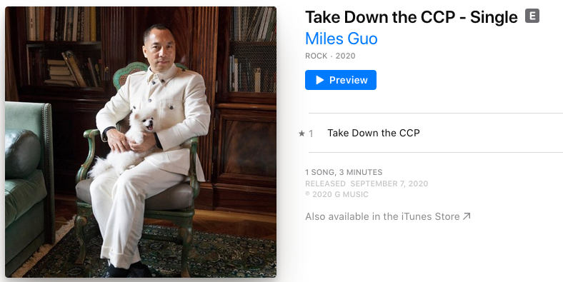
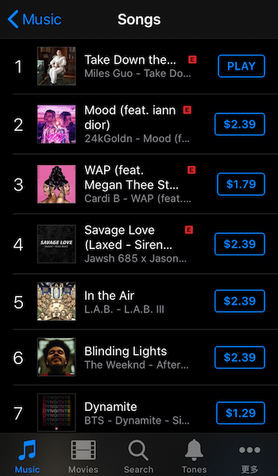
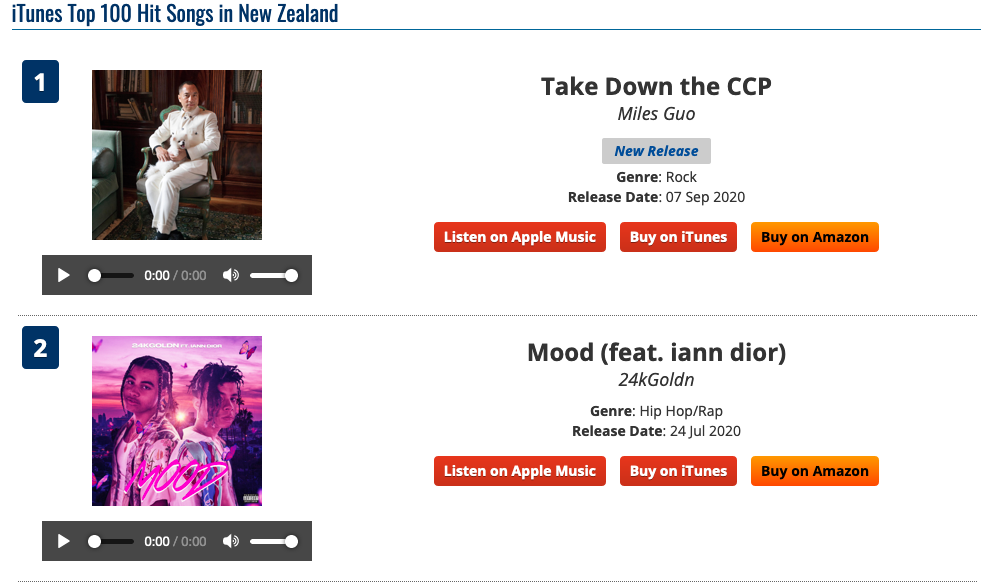
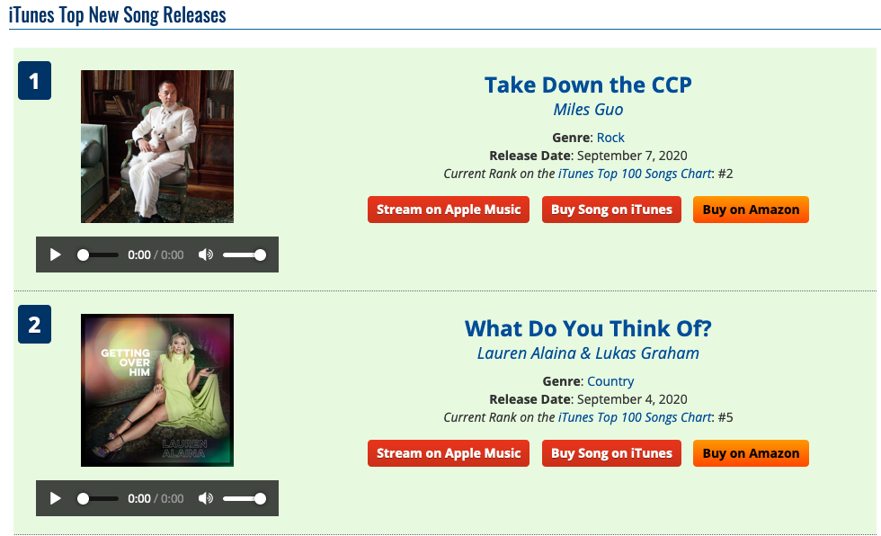
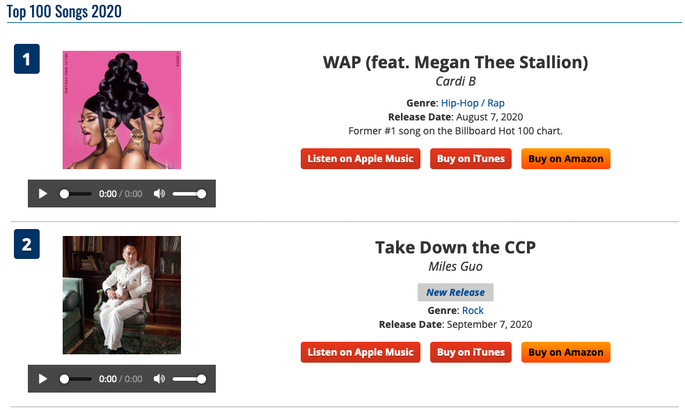
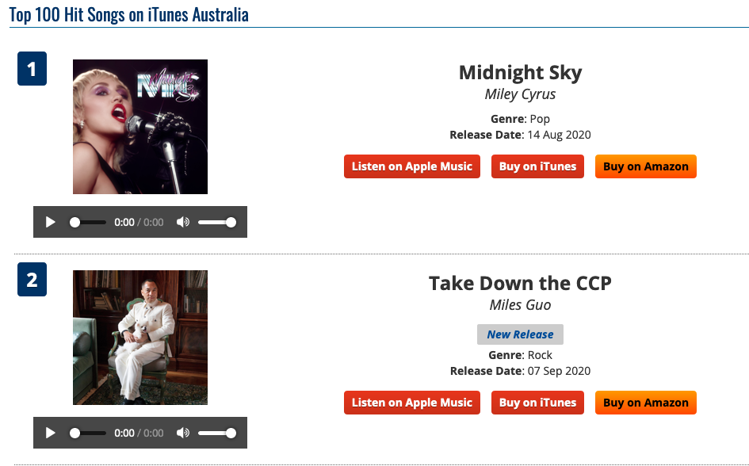
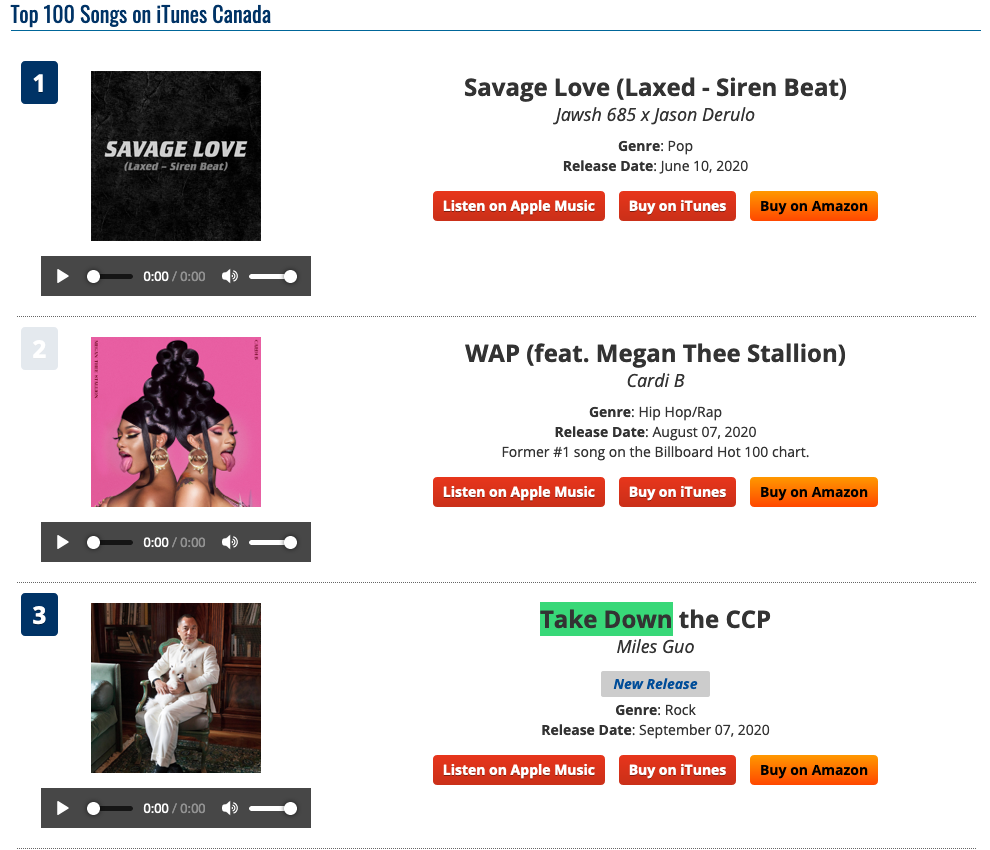
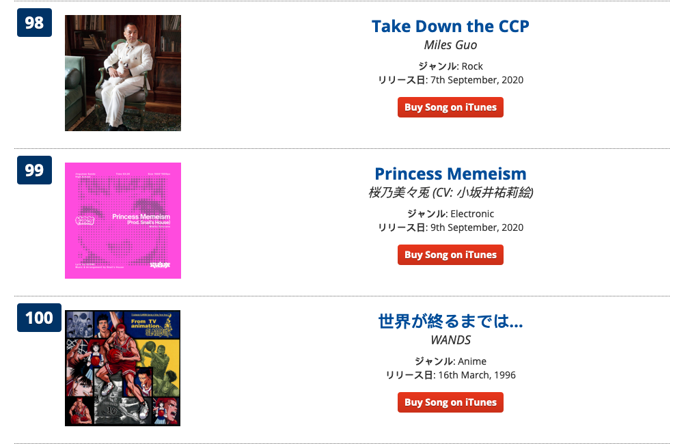
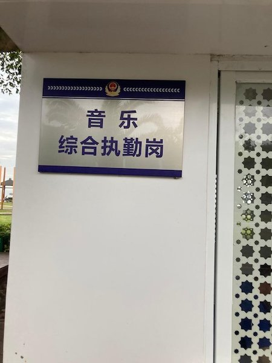

---
layout: post
title: Take down the CCP 强势占据榜首，中南坑感受到四面楚歌没有？
---

文贵先生用生命在呐喊的摇滚 Rap 新歌《Take down the CCP》自从九月七号强势上线 iTunes、Spotify、Amazon Music 各大平台，正式在以摇滚超级新星的身份出道娱乐圈。在战友们的帮助下，一出手就如火箭般的速度蹿升，超越众多新老巨星。CCP 用低俗黄色的红歌给咱们中国人洗脑七十年了，从现在开始我们可以用战友们的新文化运动音乐把这些红歌给重新格式化。毛腊肉不是说“打扫干净屋子再请客”，我们同样要把共产主义肆虐过的中华大地重新收拾整理，音乐就是最好的清洁剂之一。

还没听过的战友赶紧到 iTunes store，Amazon Music 购买单曲，或者到 Spotify，Apple Music 等包月流媒体音乐服务收听，搜索 “Take down the CCP” 歌名或者艺术家 “Miles Guo”。灭共没你不行，自己听歌总不犯法吧。

## 榜单排行

很多战友贴出自己所在地的排行榜了，我们用数据事实说话总结一下。首先说下目前占据榜首的 iTunes Store，它是苹果在 2003 年推出的音乐商店，特点是按照一首歌一首歌来购买，定价一律 99 美分。在全世界超过 150 个国家上线，在主要的欧美国家都是最主要的音乐商店，多少音乐人梦寐以求想闯入这个排行榜 top。

**新西兰**

首先看我们新西兰本地的排行榜，自昨天开始已经强势占据榜首，给咱们新西兰战友点赞！这是总榜，不是按照 Genres 的分类榜，含金量超级重磅有没有。我本人已经尽自己绵薄之力支持了。

iTunes 只能看到自己所在地，我们通过一些第三方跟踪网站来看看在其他地方的情况。数据收集时间都是北京时间九月十一日晚上10点左右。

根据 PopVortex 第三方音乐跟踪网站给出的数据同样是排名第一：

**美国**

美国范围内 iTunes 付费歌曲下载**新歌榜**当日最热排行第一：

所有新老歌总榜 Top 100 当日最热排行第二，排第一的是多次获得全美音乐奖，格莱美奖，公告牌音乐奖的金牌制作人：

**澳大利亚**

总榜 Top 100 当日最热排行第一，澳洲战友们同样给力。

**加拿大**

总榜 Top 100 当日最热排行第三。

**日本**

日本我们知道华人占比例很小，而且本土音乐力量强大和欧美流行音乐基本绝缘，这种情况下战友们也挤到了 98 位。有趣的是第 100 位就是我们都熟悉的灌篮高手里面的一首歌，直到世界尽头。CCP 不灭世界就真是走到尽头了。

**其他国家当日 Top 100**

我们再看看其他国家，在荷兰和芬兰排第 10，想不到战友们在这两个地方力量这么强大，还有菲律宾和瑞典排名也是 10几名。

这里的数据也可以看到首先华人团体在当地的人口比例和影响力，传统的移民国家美国加拿大新西兰澳大利亚几个，华人移民比例都相对较高，例如新西兰官方统计是 5%，算上非法逗留的可能有 10%。就像文贵先生之前和新西兰农场连线所说的，建设好农场团结当地华人，在当地的政治，经济影响力将得到充更分展现，对当地的政策制定、选举将能够起到举足轻重的作用。其他很多国家当地有自己深厚的文化传统例如日本，华人在当地人口比例很小。

其次可以看到爆料革命在当地的华人中的覆盖率和动员能力，战友们都时时刻刻看着爆料革命的最新动态。

国家 | 排行
------------ | -------------
荷兰 | 10
芬兰  |  10
菲律宾  |  12
瑞典  |  16
挪威  |  40
英国  |  50
比利时  |  92
意大利  |  97
瑞士  |  未上榜
波兰  |  未上榜
南非  |  未上榜
西班牙  |  未上榜
巴西  |  未上榜
丹麦  |  未上榜
法国  |  未上榜
德国  |  未上榜
希腊  |  未上榜
印度  |  未上榜
爱尔兰  |  未上榜
墨西哥  |  未上榜
奥地利  |  未上榜

## 其他音乐流媒体

现在音乐流媒体服务比较流行，就是付固定的包月费用无限量任意听所有的歌曲。我们实事求是用数据说话，在最大的 Spotify 和第二的 Apple Music，歌曲都没有上榜，咱们战友还得多努力一把多听听，排边听一边在家办公是不是感觉都充满力量了呢？是否可以向身边的老外朋友多推荐推荐一下？或者就尝试问一句这个新歌手是谁啊，怎么一上来就拍 iTunes 榜首了？

## 总结

不到几天时间就在多地冲上榜首，咱们战友的力量太伟大太团结了，这是一次爆料革命力量的小小low着点的宣示。这真是把中南坑吓傻了，国内还专门成立了音乐执勤岗，以后难道听个歌就要去喝茶了？

最后开个脑洞，中南坑要是听到周围的人都放这首歌会不会被吓得尿袋掉一地、双修的裤子都提不起来呢？这不正是当年让项羽吓破胆的四面楚歌吗？

中南坑，用音乐 We will we will rock you!
